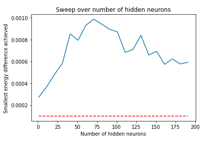
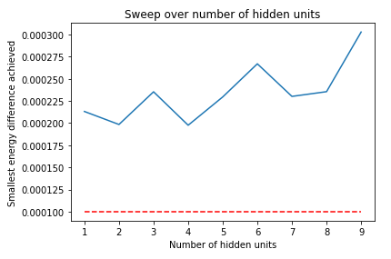
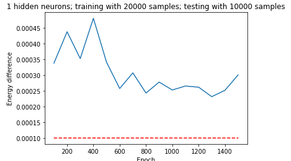
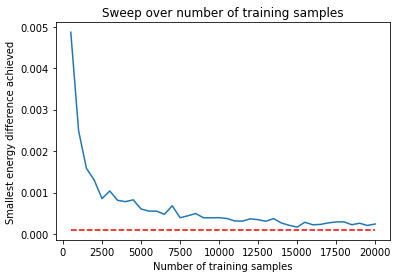

# Task 2 writeup

## 1. Minimum number of hidden units required

In the first part of Task 2, we work to evaluate the difficulty of the learning problem with the very large dataset `Rydberg_data.txt`

In order to do so, we train an RBM using the entire dataset (20,000 data points), and test to see if the RBM's predicted energy is very close to the exact energy of the molecule, over a range of steps (epochs).

We define "very close to the exact energy" with the following energy difference threshold formula:

`C = |E_{RBM} - E_{exact}| <= 0.0001`

In order to minimise statistical variation in `C` and, therefore, minimize the chance of triggering the stopping criterion too early, we find it's important to use a large number of testing samples. In our test, we use 10,000 testing samples.

To solve for the minimum number of hidden units `N_h` required, we run experiments with max epochs `E` set to 1000 while ramping `N_h` up between experiments. Starting with 1 hidden unit, we test whether `C = 0.0001`, the energy difference threshold, is met.

The following figures show the minimum value of `C` over a 1000 epoch training run for values of `N_h` (the top figure has a coarser sweep than bottom figure):

As can be read directly off the top figure above, we find that we achieve the least energy difference with low numbers of hidden units. Although the second chart has a minimum at `N_h = 4` we believe this is because of statistical noise - the general trends points to `N_h = 1` as the optimum and multiple trials support this.

Note: Since we intentionally used a large number of testing samples to minimize statistical variation in our energy difference calculations, we never actually hit the proposed target for minimum energy difference, though we approach it with the lower hidden units.

Below is a plot of `C` as a function of the number of epochs during a sample training run with `N_h = 1`.

We can solve for the "size" of the entity the RBM spits out is the equivalent storage of `100 + N_h + N_h*100 = 100 + 1 + 1*100  = 201` numbers. In comparison to `2^{100} = 1.27*10^{30}`, it's clear that the RBM's memory is much more compact and thus, extremely useful for computation.

## 2. Minimum number of data samples required

In the final part of Task 2, we are interested finding out how much data is required to learn a good model. We run multiple experiments, varying the number of training samples and examining the best `C` achieved. Here we set `N_h = 2` (double the optimal amount when training with all 20000 samples).

We found that anything above 15,000 samples seems to achieve optimal results.
