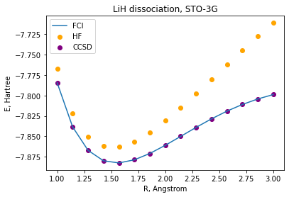

# Quantum Cohort Project Business Application

For each weekly project, your team is asked to complete the below business application exercise.
To complement the technical tasks, please consdier the four questions below.
You are free to format your response to these four questions as you wish (with the final question done as a short recorded video), and to include
the content (or links to the content) on your forked repository.

## Step 1: Explain the technical problem you solved in this exercise

The main goal of this exercise was to implement VQE in order to find the parameters that generate the fundamental state of different molecules in a quantum circuit. This included the following tasks:

- In the first task, we reviewed different approximations commonly used for estimating analytically the ground state of a many body system. These included:
    - Hartree Fock, where a single Slater determinant is proposed (no correlations)
    - Coupled Cluster methods, which are a refinement of Hartree Fock where one and two body operators are considered.
    - We also considered exact solutions, known as Full configuration interactions, where all interactions are considered.
    
- Then we analysed the corresponding qubit Hamiltonian using Jordan Wigner. The tapering technique was introduced to lower the complexity of the resulting operator by exploiting symmetries.
- In order to use VQE, we must generate the unitaries. In this task we explored 2 types, choosing between sto-3g and sto-6g basis depending on the molecule and its complexity:
    - Unitary Coupled Cluster: a direct generalization of the Coupled Cluster method. This is a “fermionic” approach.
    - Qubit Coupled Cluster: we look directly to the qubit space, optimized for a quantum circuit. This method is better for translating to existing hardware.
- In order to measure the expectation value of the Hamiltonian, complicated measures have to be made. We explored how to partition these operators into a minimal number of groups such that each member can be fully measured at the same time.
- In this final step, we converted the unitaries obtained in previous steps to gate-based algorithms able to run in existing hardware. 
We performed this task for H2, LiH and H4. Additionally, further challenges were addressed.
- We explored the framework Qulacs to simulate noise aware quantum systems in order to find the first excited state of a H2 molecule, by using VQE and orthogonality with the fundamental state.
- We analyzed and solved the Max-Cut problem with VQE. This problem is known to be NP-complete and can be significantly sped up with hybrid methods.

## Step 2: Explain or provide examples of the types of real-world problems this solution can solve
VQE provides an enormous speed up for certain optimization problems. Among these, the Max-Cut problem is of significant importance for circuit design. Better solutions to these problems would have an enormous impact both on scalability and cost reductions for technological developers.

- Microprocessors and Memory chips have a combined market share of approximately 330 billion dollars of revenue per year, with fast increasing numbers. [[1]](https://www.grandviewresearch.com/industry-analysis/microprocessor-market) [[2]](https://www.globenewswire.com/news-release/2020/02/07/1981735/0/en/Global-Memory-Chips-Market-Worth-241-Billion-by-2023-Rising-at-a-CAGR-of-22.html)
- Inside each of these components, there are up to 2 trillion transistors [[3]](https://ourworldindata.org/uploads/2019/05/Transistor-Count-over-time-to-2018.png). The way in which these transistors are distributed is fundamental for the scalability and correct functioning of the chips. This problem is known as Very Large Scale Integration (VLSI).  
- Due to lithography and etch issues with scaling, design rules for layout have become increasingly stringent. Nowadays, computers are used to simulate and find optimal strategies. 
- These geometry problems can be reduced to the Max-Cut problem in graphs [[4]](https://www.jstor.org/stable/170992?seq=1)[[5]](https://www.semanticscholar.org/paper/Network-Design-Using-Cut-Inequalities-Barahona/b683bc4caf9225056c78af45f9748de2648555e6), which are known to be NP-complete [[6]](https://dl.acm.org/doi/10.1145/800157.805047)
- VQE methods use hybrid classical-quantum technologies to solve Max-Cut problems with significant speed ups. 
- Providing better mathematical solutions would allow for smaller and more efficient chips.

## Step 3: Identify at least one potential customer for this solution - ie: a business who has this problem and would consider paying to have this problem solved

In recent years, there has been a significant increase in the demand for chip driven products. Seeing this phenomenal market demand and with the design and manufacturing market (both domestic and international) expanding rapidly, there is an enhanced demand for algorithms that improve the optimization and design techniques that are used today.

**Market Opportunity:** The integrated circuits market has grown continuously from its beginning to the present. In 2019, the market reached 330 billion dollars in revenues and this value is estimated to continue growing in the coming years according to the business data platform Statista.

**Target Customers:** Companies engaged in large-scale manufacturing of semiconductors and integrated circuits (IC) interested in innovation:

Intel Corporation
Revenue: $72 billions [[Intel]]
Samsung
Revenue: $218 billion U.S. dollars [[Samsung]]
Texas Instruments
    Revenue: $14 billions [[Forbes]]
Advanced Micro Devices (AMD)
Revenue: $6 billions [[AMD]]
IBM
Revenue: $77 billions [[IBM]]
Toshiba
Revenue: $33 billions [[Macrotrends]]
Nvidia
Revenue: $11 billions [[Forber]]

## Step 4: Prepare a 90 second video explaining the value proposition of your innovation to this potential customer in non-technical language

Link to video:

