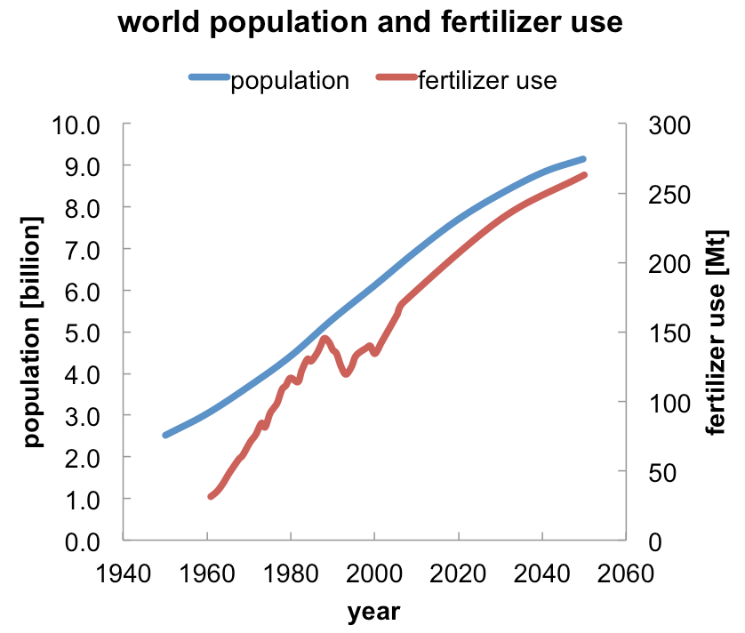
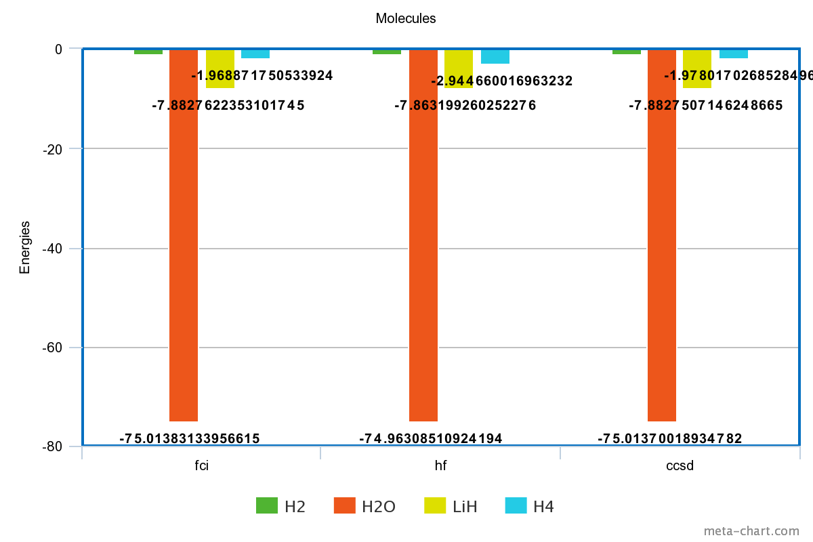
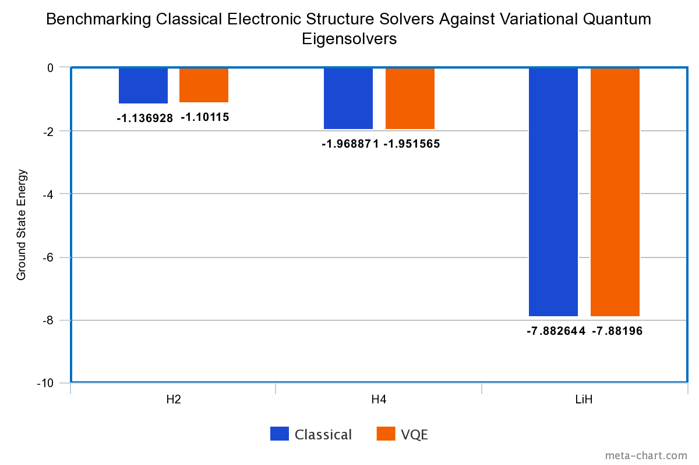

# Improving Fertilizer Production Using Quantum Computing
<!--- # Quantum Computing For a Better Fertilizer Production --->
<!---  # Could the Quantum Computing Revolution Help Feed the World?  --->

## Overview

Synthetic fertilizers have sustained the population growth in the past century since they were introduced in 1914, and the production of fertilizer is expected to expand in the coming decades to feed an ever-growing world population (please refer to the figure below). [1,2] Fertilizer manufacturing is an energy-intensive industry. It has been estimated that it accounts for approximately **1.2%** of the world's energy, of which about **93%** is consumed by nitrogen-based fertilizers. [3,4] Unlike two other essential soil nutrients, phosphorous and potassium, nitrogen does not persist in the soil long after application, making frequent reapplication of nitrogen-based fertilizers necessary. [5]

## Step 1: Explain the technical problem you solved in this exercise

One of the fundamental technical challenges in physics and chemistry is to accurately calculate the potential energy surfaces (PESs) for small molecules. Although there exists some approximation techniques using classical computational methods, these are limited to cases that have less bonds (i.e. 1 or 2 bonds such as LiH and H4 respectively) and for weakly correlated systems. But why do we need PES in the first place? Through the accurate computing of PES value, we can control many real world applications such as the breaking of N2 bonds to make NH3. Subsequently, the breaking of the NH3 bonds can serve the agricultural sector in producing fertilizers while the energy released from the bond-breaking process can be employed to supply energy demand.  The importance of quantum computing lies in the ability to accurately compute PES for small molecules with highly correlated electronic structure systems while reducing time complexity, which is deemed essential in real world applications. 

We are gonna add here a grouped bar charts to benchmark the ground state energies with classical, simulator and quantum computer results. Hopefully the results from the IBM quantum computers will be ready by tomorrow for comparison and analysis.

<!---  --->

   

## Step 2: Explain or provide examples of the types of real-world problems this solution can solve
The near-term hybrid quantum algorithm, VQE has immediate and future applications in interdisciplinary areas among chemistry, material science and finance: 

-	Energy sector through generating energy from breaking molecular bonds 
-	Agricultural sector through fertilizers
- Solving deep evironmental problems on the planet with Ozone dissociation [6] 
- Screening and design of new drugs using molecular dynamics simulations. [7]
-	Material Simulation (electronic structure to find advanced materials) 
-	Battery Optimization 
-	Finance and Portfolio Management to maximize profit/wealth and minimize risk. [8] 

## Step 3: Identify at least one potential customer for this solution - ie: a business who has this problem and would consider paying to have this problem solved

Office Cherifien des Phosphates (OCP Group) is a viable customer to efficiently employ phosphates resources. OCP group is based in Morocco and has **70%** of the world’s phosphate raw reserves, which are essential for production of fertilizers world-wide. Additionally, it is a profitable market which allowed the company to yield a net profit of **US$5.88** billion revenue. The OCP group would be of particular interest to the application of VQEs because nitrogen is central to their fertilizer production, thus the profitable outcome of this innovative technique will maximize their revenues through employing this newest technology to remain in the lead in this competitive industry. Fortunately, they are heavily involved in R&D by investing massively in new technologies such as their most recent investment in **artificial intelligence** in 2018. [9,10,11] 

The Teal Technology Services was a recent **joint venture** between the **OCP group** and **IBM** for smart farming and to accelerate the digital transformation of their clients. [12] Given that IBM can provide state of the art quantum computing technology while the OCP group is the leading manufacturers of fertilizer; this will serve as the ideal opportunity to reinforce their relations as the OCP group will highly benefits from IBM quantum technology and vice versa.

## Step 4: Prepare a 90 second video explaining the value proposition of your innovation to this potential customer in non-technical language

https://www.dropbox.com/s/ceq2x7sd662zxom/Project_week_2.mp4?dl=0

## References
[1] T. L. Roberts, "The Role of Fertilizer in Growing the World's Food," Better Crops 93, 12, 2009.

[2] N. Alexandratos and J. Bruinsma, "World Agriculture Towards 2030/2050: The 2012 Revision," Food and Agriculture Organization of the United Nations, ESA Working Paper No. 12-03, June 2012.

[3] "The Fertilizer Industry, World Food Supplies and the Environment," International Fertilizer Industry Association, December 1998.

[4] S. Wood and A. Cowie, "A Review of Greenhouse Gas Emission Factors for Fertiliser Production," IEA Bioenergy, June 2004.

[5] F. Tenkorang and J. Lowenberg-DeBoer, "Forecasting Long-Term Global Fertilizer Demand," Nutr. Cycl. Agroecosys. 83, 233, 2009.

[6] FY2016 LDRD Annual Report - Simulating Excited State Energies and Dynamics with Superconducting Qubits (Pg. 30)   https://www2.lbl.gov/DIR/assets/docs/16LDRD-PUB_LBNL-103E-2016.pdf

[7] 16 Startups Using Quantum Theory To Accelerate Drug Discovery   https://www.biopharmatrend.com/post/99-8-startups-applying-quantum-calculations-for-drug-discovery/

[8] Barkoutsos et al., "Improving Variational Quantum Optimization using CVaR, " quantum-journal.org, 2020.

[9]	Moroccan Giant OCP Invests In Artificial Intelligence.   https://moroccotravelblog.com/scalia_news/moroccan-giant-ocp-invests-in-artificial-intelligence/

[10]	Morocco’s OCP Invests in Digital to Take Lead in African Agriculture.   https://www.moroccoworldnews.com/2019/04/270958/morocco-ocp-digital-lead-african-agriculture/ 

[11]	World's Largest Phosphate Miner OCP is Open to Foreign Investors.   https://investingnews.com/daily/resource-investing/agriculture-investing/phosphate-investing/worlds-largest-phosphate-miner-ocp-is-open-to-foreign-investors/ 

[12] OCP Group and IBM from Joint Venture to accelerate digital transformation for Moroccan and African companies.   https://www.ocpgroup.ma/en/ocp-group-and-ibm-form-joint-venture-accelerate-digital-transformation-moroccan-and-african 
