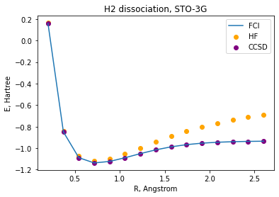
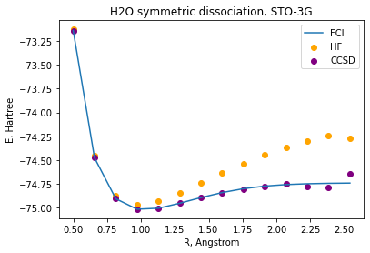
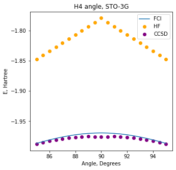
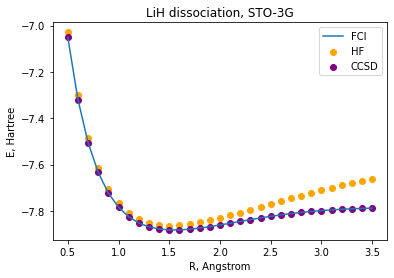
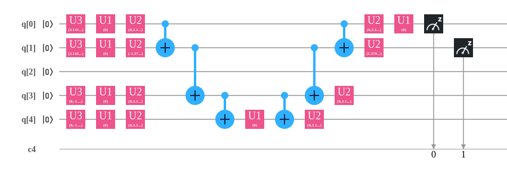
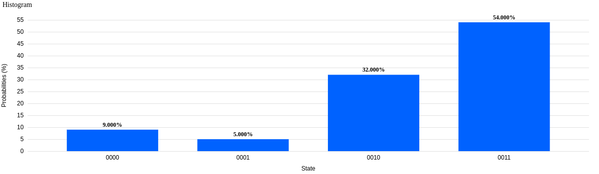
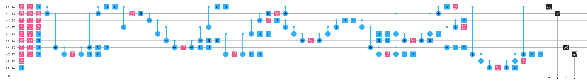
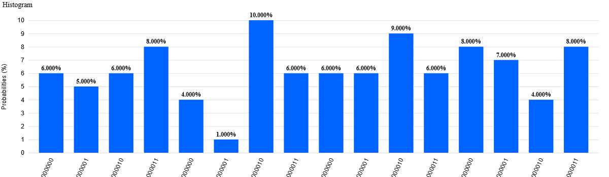
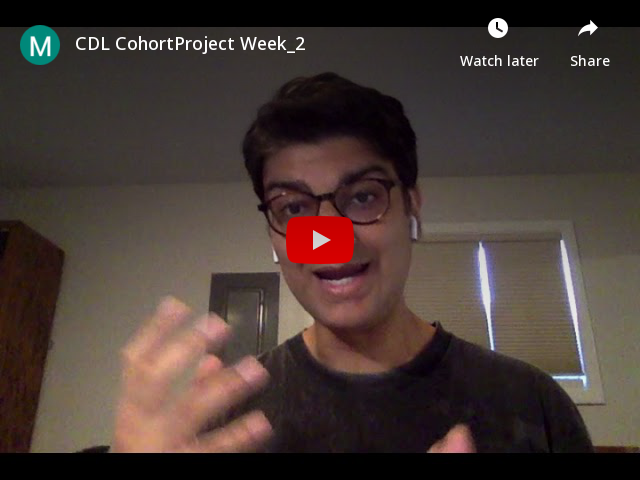

## Project 2: VQE
This week you will explore the Variational Quantum Eigensolver (VQE) for
constructing potential energy surfaces for small molecules.
A very brief introduction to the main ideas behind the VQE are 
[here.](https://github.com/CDL-Quantum/CohortProject_2020/blob/master/CDL_2020_docs.pdf)
Open up [Project2_LandingPage.pdf](https://github.com/CDL-Quantum/CohortProject_2020/blob/master/Project_2_VQE_Molecules/Project_2_LandingPage.pdf)
to begin learning about your tasks for this week!
## Setup
A conda environment .yaml file has been provided to create a replica of the environment that has been used to run all code samples in this repo.

**Command:**

cd environment

conda env create --file CDLWeek2.yml

## Tasks and Challenges
Using H2 and H2O as examples, you will implement the main steps of the VQE process from the setup of the Hamiltonian to obtaining the circuit for the IBM quantum computer.  A number of additional challenges and 
business-related questions are suggested in the above.

## S1_Classical_Methods
We employ a variety of different classical algorithms for calculating the molecular bond energy. The choice of algorithm is based on a tradeoff between speed and accuracy. These methods give us an anchor to help us calibrate and understand our smaller scale quantum experiments.

## S2_Hamiltonian_gen
Generating the qubit hamiltonian requires mapping the fermionic states to qubit states through Jordan-Wigner transformation. The qubit hamiltonian produces the number of orbitals needed to represent the molecule and the number of qubits required. We then tapper the hamiltonian to reduce the number of qubits required to represent the molecule. The elements of the tapered hamiltonian generate a matrix. The eigenvalues are from this matrix.

## S3_Unitary_Ansatz
We generate elementary unitary operations with UCC and QCC . Unitary Coupled-Cluster seemed very resource-heavy and took too long to generate any useful results. The Qubit Coupled-Cluster was instead leveraged as it returned results within reasonable time frames. The calculations were made with STO-3G basis because the size of the calculations was reasonable and achievable with our available machines. Ideally, we would use a 6-31g basis however, we were unable to determine the process and or theory required to restrict the active space. Freezing all other orbitals beyond the necessary few would have allowed for simpler calculations. The same problem occurred when we attempted to generate unitaries with a sto-3g basis when it came to larger molecules like LiH.  

## S4_Measurement
In MeasurementUnitaryGenerator.py we encapsulate all the functionality (partitioning into fully commuting groups and qubit-wise commuting groups) required for preparing the pre-measurement unitaries.
As a challenge, we also tried implementing further reduction via SVD truncation. We find that we are able to reconstruct the hamiltonian from the SVD, but we need to set high thresholds for truncation in order to get results similar to Table 1 of https://arxiv.org/pdf/2007.01234.pdf. For example, with H20, we need to set the threshold to ~50 in order to get a significant reduction (at this value we end up with 25 measurement groups after FC partitioning). To verify the resulting Hamiltonian, we computed its minimum eigenvalue (-82.4) and compared against that of the non-truncated version (-99.2). The energy difference seems large. We’d need further time to understand our method in detail and verify that we are applying the right steps.

## S5_Circuits
We provide a simple framework to calculate PES energy using quantum hardware devices. Our quantumPES module allows your scientists to select a molecule, prepare the circuits for deployment and finally launch the jobs with three lines of code. Our optimization of the the molecule energy function for submission to the Quantum computers ensures the smallest job footprint is created to minimize the number of circuits to be executed. 

**H2**

**H20**

## Business Application

**For more details refer to the [Business Application found here](./Business_Application.md)**

# Further Challenges - Business-related questions in the context of quantum entrepreneurship

**1. What other molecular properties can one obtain using VQE for the purpose of rational material and drug design?**

Interview with Gavin from IBM

Outside of reactions, another area of interest are general properties of molecules. Examples include dipole moments, excited states (this is one property, he says, that all industries care about!), electro-chemical processes - Can we make OLEDs, photoacid generators, and better batteries out of these things? Scientists also care about the interaction of molecules with light. On the materials side, they care about periodic solids and crystalline materials. And, one thing scientists care about that is cross-cutting is quantum machine learning to improve anything that they are doing classically. 

**2. What are the systems (molecules/materials) which are challenging for classical computing and whose modelling is valuable?**

Interview with Gavin from IBM

I asked Gavin if there large molecules that currently cannot be studied, but that are very important/impactful. His immediate answer was the iron complex that is used for nitrogen fixation (1-2% of the world’s energy is consumed for this process). But he said we are probably years away from fully understanding that. 

**3. What businesses can benefit from more accurate electronic strucutre calculations?**

Interview with Gavin from IBM

I asked Gavin if he knows of cases where VQE has been used in industries outside of chemistry/pharmaceuticals. He said that VQE has actually been adapted and used in finance for the use case of CVAR (conditional value-at-risk). Then they took this method from finance and used it back in the chemistry world!
  Also he said people have thought about how to use VQE QAOA for optimization algorithms within chemistry.

## Presenting your results in your pull request
For your pull request, consider the following for the presentation of your final results:
- Work entirely in the directory for Project 2.
- Edit this README.md file with a highlight of your main technical results.  Provide links to any other files with your detailed results, e.g. Jupyter notebooks.
- For your Business Application, feel free to provide your answers directly in the 
[Business_Application.md](./Business_Application.md) file.
- Do not directly upload your video file (or any other large files) to the repository.  Instead, provide a link e.g. to a YouTube video, or a Google Drive file.
- Include a file contributions.md that lists the contributions of each group member.
