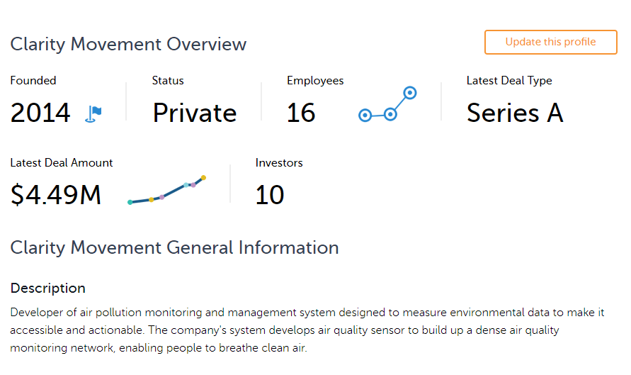

# Quantum Cohort Project Business Application

## Step 1: Explain the technical problem you solved in this exercise

The technical problem we solved in this exercise involves calculating the Frank Cordon Factors (FCFs), which are useful in studying vibronic transitions in molecules. We calculated the FCFs for H2-H2+ using the harmonic oscillator approximation. Calculating FCFs is basically the same as calculating the overlap between the wavefunctions before and after the vibronic transitions. We then calculated the photoionization spectrum for V3 and finally simulated a Gaussian Boson Sampling experiment, which generates samples for computing a vibronic spectrum.

## Step 2: Explain or provide examples of the types of real-world problems this solution can solve

Some of the real world problems that this solution can solve include :

## 1) Astronomy 

Comets consist of almost pristine material from the early formation of our solar system, unprocessed by harsh solar sunlight. Studying the chemistry of these "dirty snowballs" gives us a clue as to the composition and nature of our solar system in its infancy and constrains theories of how life may have formed on Earth. Another application would be probing the formation of stars in colliding galaxies.

Reference : http://loke.as.arizona.edu/~ckulesa/camp/spectroscopy_examples.html

## 2) Drug Discovery 

Vibrational spectroscopies, including infrared and Raman techniques, are important tools for the characterization of chemical composition, molecular structures, and chain orientation under mechanical deformation of polymeric materials.

Reference : https://www.researchgate.net/publication/334309511_Some_Applications_of_Vibrational_Spectroscopy_for_the_Analysis_of_Polymers_and_Polymer_Composites

## 3) Chemical Sensor Applications in Medicine and Climate Science

Spectroscopy has successfully been used as transducers for chemical sensors. Other than most standard transducers, vibrational spectroscopic sensors are capable of multi-component detection, both qualitatively and quantitatively. This opens a wide field of possible applications, covering in-situ real-time industrial process control as well as environmental pollutant screening. This has applications in Magnetic Resonance Imaging (MRI) and Climate Science.

Reference : https://www.researchgate.net/publication/236259701_VIBRATIONAL_SPECTROSCOPIC_SENSORS_-_Fundamentals_Instrumentation_and_Applications

## 4) Manufacturing

The development of fiber-optic-based spectrometers has broadened the use of vibrational spectroscopy for process monitoring in various fields including
polymerization, curing, and manufacturing processes.

Reference : https://www.ncbi.nlm.nih.gov/pmc/articles/PMC6680764/

## Step 3: Identify at least one potential customer for this solution - ie: a business who has this problem and would consider paying to have this problem solved

## 1) Environmental Sensing

Clarity Movement Co. is an environmental startup transforming how cities understand and solve air pollution with next-generation air quality monitoring technology since 2014. Their turn-key solution provides real-time, hyper-local air quality data that supplements a city’s existing regulatory monitors with a continuously-calibrated network of hundreds to thousands of additional air quality sensors. The Clarity Air Monitoring Solution makes air quality management more accessible, cost effective, and actionable than ever before.

Clarity Movement will be an example of a potential customer for the use of these techniques in the use of sensitive chemical sensor applications to detect air quality and pollutant screening.

https://www.clarity.io/

 

Other potential environmental sensing clients would be Aclima, eLichens and Libelium.
## Step 4: Prepare a 90 second video explaining the value proposition of your innovation to this potential customer in non-technical language

https://www.youtube.com/watch?v=CodrXcxhZu8&feature=youtu.be
