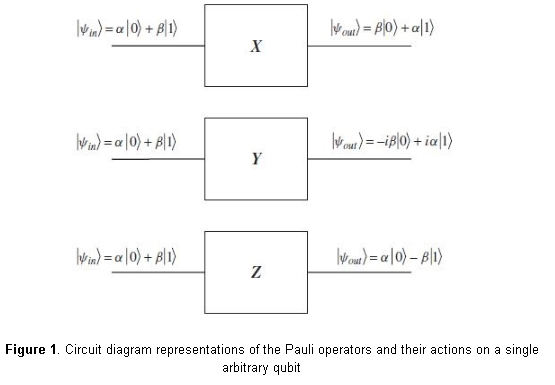
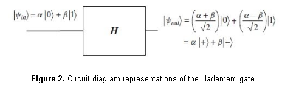

## 1. Explain to a layperson what theoretical chemistry/physics is, in the general context of Franck-Condon Factors.
Theoretical physics is a branch of physics that employs mathematical models and abstractions of physical objects and systems to rationalize, explain and predict natural phenomena. The main aim of physics is to understand the laws of nature and phenomena around us.  In order to do so an in-depth study to discover and understand the laws of causes and effects is of paramount importance. For example, when a ball is lifted up and dropped, it falls.  The aim of Theoretical Physics is to formulate the law of the way the ball behaves as it falls during the time it takes to fall down [[1]](https://en.wikipedia.org/wiki/Theoretical_physics#:~:text=Theoretical%20physics%20is%20a%20branch,explain%20and%20predict%20natural%20phenomena.&text=In%20some%20cases%2C%20theoretical%20physics,weight%20to%20experiments%20and%20observations).

In general physicists use theories to make predictions and carry out experiments to test the predictions. In the case of the falling ball, there are two main theories: Newtonian gravitation and General Relativity. Both describe the way bodies act on one another but they describe this in different ways. Theoretical physicists invent and study theories. These theories are formulated in mathematical language using mathematical tools.  The discipline of mathematical physics focuses on the more formal aspects of physics.

Theoretical chemistry is a branch of chemistry which develops theoretical generalisations that are part of the arsenal of modern chemistry. Theoretical chemistry links fields such as chemistry, physics, materials science and biology. It also encompasses any application of mathematical and computational techniques to problems and systems of chemical and related interest such as, the concepts of chemical bonding, chemical reaction, valence, the surface of potential energy, molecular orbitals, orbital interactions, molecule activation [[2]](https://en.wikipedia.org/wiki/Theoretical_chemistry) etc. Modern theoretical and computational chemistry works – or should work – hand-in-hand with fields such as biochemistry, nanotechnology, and materials sciences.

The Franck-Condon Principle is a rule in spectroscopy and quantum chemistry that describes the intensity of vibronic transitions. The principle states that when a molecule is undergoing an electronic transition, such as ionization, the nuclear configuration of the molecule experiences no significant change. This is due in fact that nuclei are much more massive than electrons and the electronic transition takes place faster than the nuclei can respond. When the nucleus realigns itself with the new electronic configuration, the theory states that it must undergo a vibration.

##  2. What is the importance of theoretical chemistry/physics from an economic point of view?
The governments have funded research and development (R&D) for centuries because of its perceived socio-economic effect. There is a massive demand on quantitative studies and indicators on the impact of science. Science is the root upon which modern technology stands, which in turn, has a direct impact on consumerism, applied technology, public service, automobile, computing, security, space technology, energy sector etc. However, at the base of every scientific and technological effort, which has ever been transformed into an applied solution, is the fundamental theoretical science, be that physics or chemistry or a combination of both, that makes it possible.

In Europe, currently, economic numbers show that Physics has a higher importance than finance in economic impact[ [7]](https://cdn.ymaws.com/www.eps.org/resource/resmgr/policy/eps_pp_physics_ecov5_full.pdf). Physics-based industries generate over 16% of total turnover and more than 12% of overall employment in Europe, topping contributions from the financial services and retail sectors, according to a report published by the European Physical Society (EPS) [[7]](https://cdn.ymaws.com/www.eps.org/resource/resmgr/policy/eps_pp_physics_ecov5_full.pdf). The analysis, carried out by UK consultancy firm Cebr (Centre for Economics and Business Research), reveals that physics makes a net contribution to the European economy of at least €1.45 trillion per year, and suggests that physics-based sectors are more resilient than the wider economy.

As a context to these numbers, the turnover per person employed in the physics-based sector substantially outperforms the construction and retail sectors in Europe, and physics-based labour productivity (expressed as gross value added per employee) was significantly higher in 2018-2019 than in many other broad industrial and business sectors, including manufacturing.

Based on several different measures of economic growth and prosperity, the analysis found that physics-based goods and services contributed an average of 44% of all exports from the 28 European Union countries during the relevant period. The three major contributions were from manufacturing (42.5%), information & communication (14.1%), followed by professional, scientific & technical activities in physics-based fields such as architecture, engineering and R&D (14.1%). Distributions in employment data were found to be broadly similar, with professional, scientific & technical activities showing the strongest employment growth. Germany showed by far the highest percentage of turnover from physics-based industries (29%), followed by the UK (14.2%), France (12.9%) and Italy 10.4(%).

Taking into account “multiplier impacts” that capture the knock-on effect of goods and services on the wider economy, the analysis found that for every €1 of physics-based output, a total of €2.49 output is generated throughout the EU economy. The employment multiplier is higher still, meaning that for every job in physics-based industries, an average of 3.34 jobs are supported in the economy as a whole by these industries.

The report also found the European physics-based sector to be highly R&D intensive, with expenditure exceeding €22 billion every year.

In case of theoretical chemistry, molecular modelling of chemicals and materials including the mechanisms by which impact is achieved and how it is measured has given rise to a number of technology trends [[8]](https://doi.org/10.1002/aic.11932)[[ 9]](https://mafiadoc.com/the-economic-impact-of-molecular-modelling-of-wordpresscom_598ea2f51723ddcf69a3e933.html) which in turn have contributed to increased applicability and acceptance in recent years, including the following:

 -Much increased capabilities of hardware and software.

 -A convergence of actual technology scales with the scales that can be simulated by molecular modelling as a result of nanotechnology.

 -Improved know-how and a focus in industry on cases where molecular simulation works well.

The acceptance level still varies depending on method and application area, with quantum chemistry methods having the highest level of acceptance, and fields with a strong overlap of requirements and method capabilities such as electronics and catalysis reporting strong impact anecdotally and as measured by the size of the modelling community and the number of patents.

In recent years, many economists have questioned the ability of technological progress to keep propelling the economy forward despite declining population growth and rising dependency ratios (Gordon 2016). According to those in this camp, the low-hanging fruit have mostly been picked, and further advances will become increasingly difficult (Bloom and others 2017).

Widespread belief is that science allows us to build taller and taller ladders to reach ever-higher-hanging fruit. Based on rapidly improving scientific insights, technological breakthroughs still have the potential to change life in the foreseeable future as much as they did in the century and a half since the US Civil War, proponents of this view contend.

Humans have limited ability to make highly accurate measurements, to observe extremely small objects, to overcome optical and other sensory illusions, and to process complex calculations quickly. Technology consists in part in helping us overcome the limitations that evolution has placed on us and learn of natural phenomena we were not meant to see or hear—what Derek Price (1984) has called “artificial revelation.”

If the history of the first two industrial revolutions was dominated by energy, the future may well witness truly radical progress in the evolution of new materials. Many technological ideas in the past could not be realized because the materials that inventors had available were simply not adequate to make their designs a reality. But recent science-driven advances in material science allow scientists to design new synthetics that nature never had in mind. Such artificial materials, developed at the nano- technological level, promise the development of materials that deliver custom-ordered properties in terms of hardness, resilience, elasticity, and so on. New resins, advanced ceramics, new solids, and carbon nanotubes are all in the process of development or perfection.

Artificial intelligence, quantum computing, lasers, and genetic engineering seem to qualify as general purpose technologies (GPTs) that have many applications across a wide spectrum of uses in production and research. It seems widely agreed that usually GPTs (General Purpose Technology) —such as machine learning—take time to fully affect the economy, because by definition they require complementary innovations and investments. But they promise transformative changes in the human condition across many dimensions.

##  3. Explain to a layperson what is a quantum circuit and its relationship to theoretical chemistry/physics.
The elementary component of a quantum computer – a qubit – is a two-state quantum system. A qubit can be constructed from many different physical systems. The qubits can be assembled to create "quantum gates", analogous to classical logic gates. There are various types of quantum gates such as Hadamard, Pauli, Unitary, Swap etc. The action of a quantum gate can be represented by drawing a circuit diagram. Each unitary operator or gate is represented by a block with lines (or “wires”) used to represent input and output. For example, the representations of the Pauli operators X, Y , and Z and their action on a single qubit are shown in the following Figure 1 (taken from [1]). The circuit diagram representation of a Hadamard gate is shown in Figure 2.

The rudimentary fundamentals of quantum computing has its base in theoretical physics. The basics of quantum computing dictate the usage of simulated or physical quantum gates in quantum circuits in order to run and leverage any quantum algorithm. One of the most critical applications of quantum computing as identified currently is in quantum and theoretical chemistry and associated modelling.
As theoretical physics drives the creation and implementation of advanced algorithms for quantum computers to help them grow in scalability and maturity, many of the classical computational tools will be supplemented with, or even replaced by, quantum computations. Furthermore, quantum computation will likely inspire new theoretical approaches and computational methods for solving problems in chemistry[[2]](https://arxiv.org/abs/1812.09976%20(2018)).

## 4. What are advantages and disadvantages of codes licensed for public domain and those licensed for private use.

Before discussing the advantages and disadvantages of public and private use licensed codes, let’s understand how they differ in nature and economics.

### Codes licensed for public domain:
According to the law, any creative work by default is assumed to be under exclusive copyright held by the author. But an author may wish her/his work to be modified, used and updated by the public. In that case she/he needs to apply for an open source license which grants several permissions based on its nature to the public domain to modify, use or update the work without making everyone an exclusive copyright holder in absence of a license.
### What is an Open source license?
Open source licenses grant permission for anybody to use, modify, and share licensed software for any purpose, subject to conditions preserving the provenance and openness of the software. An open source license protects contributors and users.
### Types :
Copyleft and Permissive licenses
Copyleft is the practice of granting the right to freely distribute and modify intellectual property with the requirement that the same rights be preserved in derivative works created from that property.
A permissive open source license is a non-copyleft open source license that guarantees the freedom to use, modify, and redistribute, while also permitting proprietary derivative works.
Let’s take a look at a few popular licenses and the permissions they grant(green), conditions of producing said documents they pose(blue) and limitations they have(red). 

1. MIT License

2. Apache 2.0

3. GNU GPLv3

Details of these licenses and more licenses can be explored here [[1]](https://choosealicense.com/no-permission/).

### What are the economics/costs  involved ?
-The initial license fee for the software product (zero in the case of an open source software product).

-Any costs associated with hardware or software tools to develop or test the software product.

-Any costs involved with customising or configuring the product.

-Any associated hardware costs to deploy the software product.

-Any hosting costs.

-Any maintenance costs.

-Any support costs.

-Any additional software license costs.

-Any costs associated with feature or functionality updates.

-Any license costs to access other 3rd party software.

-Any insurance costs.

-Any direct or indirect costs associated with future updates / upgrades.

-Any training costs.

-Any warranty costs.

-Any direct/indirect liability costs.

### Advantages
-Very low cost, you can say negligible cost or free.

-No vendor integration

-Collaboration culture

-Highly efficient and quality product software

-The audit is very easy

-Updates anytime anywhere

-License management

-Debugging is easy

-Abundant support

-Large community

-Scaling

-Consolidating

-Very low hardware cost

### Disadvantages
-It can be less user-friendly to some people as we are copying the source code indirectly.

-Sometimes support issue may also go wrong

-Though open-source license is free there are charges associated with its plugin modules and many other things.

-Malicious users can potentially view it and exploit any vulnerabilities.

### Codes licensed for private use:   
Proprietary software, also known as closed-source software, is non-free computer software for which the software's publisher or another person retains intellectual property rights—usually copyright of the source code but sometimes patent rights.[6] Of all types of software licenses, this is the most restrictive. The idea behind it is that all rights are reserved. It’s generally used for proprietary software where the work may not be modified or redistributed.
Commercial, proprietary software typically has specific features and capabilities. It appeals to a specific audience and aims to provide a superior user experience. These programs usually include regular upgrades, technical support and a wide range of tools. They also tend to be easier to use and provide greater functionality than open platforms.
These products belong to the individuals or companies that developed them. Their source code is not available to the public. They're constantly updated to detect and remove bugs and vulnerabilities, but these updates often come at a price. Developers are aware of the latest industry standards and incorporate these concepts into their programs.
 
With a few exceptions, most proprietary platforms require a license and maintenance fees, so the costs add up. Plus, users depend on developers for support, updates and upgrades. Some features are pretty much useless for the average person who may not have the skills and expertise to fully utilize them. This means you could end up paying for things that you don’t really need or use.
 
Another drawback is that you cannot modify or customize the software. If you need additional features, you must upgrade to a more advanced version – and pay extra. Dropbox, for example, offers 2 GB of space for free. Users who need more storage space are required to upgrade to a Plus or Premium plan. The Plus version lacks many of the features associated with Premium plans, such as shared link controls, device approvals, smart sync and priority chat support.
Additionally, software programs come and go – just like the companies behind them. If the developer goes out of business or decides to stop production for a software package, your day-to-day operations suffer and switching to another program can be difficult and time-consuming.
 
### Summary 
The distinction between open source and proprietary software is not that one is free and the other is not. They are each based on differing philosophies, methodologies and business models. These fundamental factors are what lead to their separate sets of pros and cons. These must be weighed within the context of each individual software development process.
 
Overall cost is a secondary consideration of companies that choose to adopt open source platforms. That factor typically comes up as no. 2 in surveys. The number one reason is the belief that the open source software chosen is technically superior to software from proprietary vendors. The answers on that point very likely differ depending on the business and market of the respondent however. From a big picture point of view, the basis of a decision to adopt one over the other is an example of the classic tradeoff between flexibility and usability. Open source software is, almost by definition, more flexible but requires more effort to use, whereas the opposite is true for proprietary software in general.
 
Many enterprises are successful with either approach and many utilize both approaches simultaneously. Neither choice can ever be said to be the absolutely best, but currently open source is gaining ground over proprietary solutions in some areas. Whereas most companies are quite familiar with closed source software, new adopters of open source solutions should monitor progress and fairly compare the advantages and disadvantages for themselves.
 
