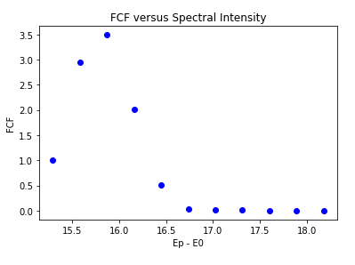
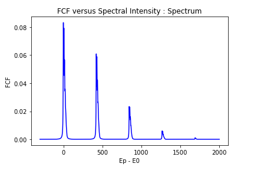
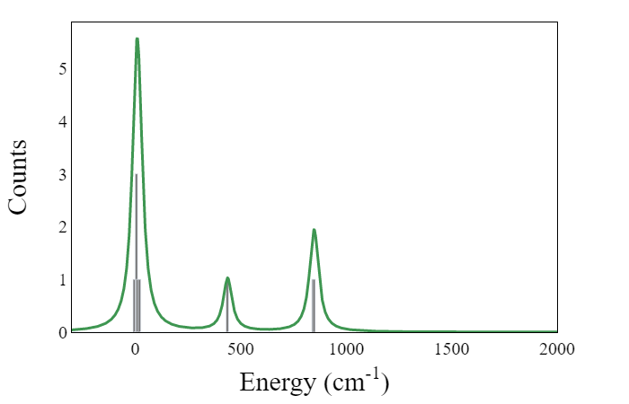
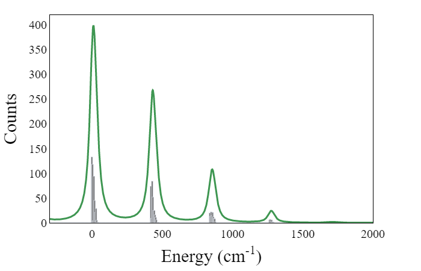
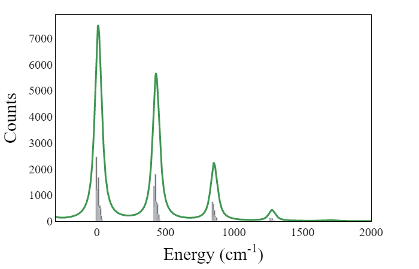
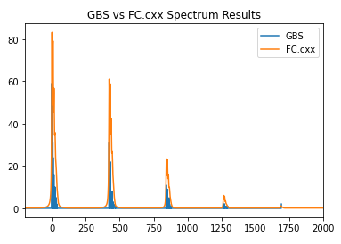

## Project 3: Franck-Condon Factors

### Members

* Nick Allgood - Business
* Anand (T Anandakkoomar) - Technical Task 1 & 2
* Jake Malliaros - Technical Task 3
* Agustin Bingu
* Natalie Kilber

## Tasks

### Task1
In this task we calculated Franck-Condon Factors for H2-H2+ using the harmonic oscillator approximation and compared it to a real experiment. 

([Notebook](Task1.ipynb))

### Task2
In this task we calculated the photoionization spectrum for the molecule V3 at a temperature of 500K. 
([Notebook](Task2_viz.ipynb))

[Spectrum Assingments](Task2.pdf)

### Task3
In this task we simulated a Guassian Boson Sampling (GBS) experiment for various sample sizes, then compared it results from the previous task. 
([Notebook](Task3.ipynb))

#### 10 Samples:

#### 1000 Samples:

#### 20000 Samples:

Now comparing Guassian Boson Sampling with Frank-Condon Factor:

## Business Application:

[Link](Business_Application.md)

