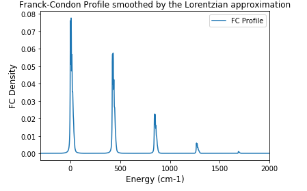
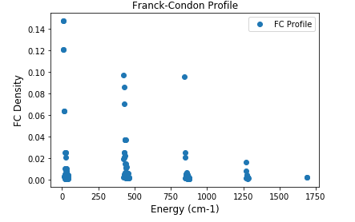
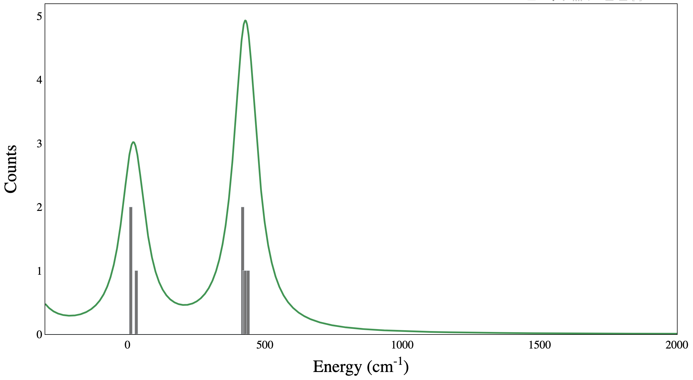

## Project 3: Franck-Condon Factors

In this project our team calculated Franck-Condon Factors (FCF), which are useful in studying vibronic transitions in molecules. We applied different techniques in finding FCF such as harmonic oscillator approximation, Gaussian Boson Sampling (GBS), and Hermite polynomials.

## Tasks and Challenges:

1. [Task #1](https://github.com/olgOk/CohortProject_2020/blob/master/Project_3_Franck_Condon_Factors/Task1.ipynb) In this task, we calculated the FCF and the spectra of molecule Hydrogen using harmonic oscillator approximation. We then approximated each possible transition by Gaussian function. One can infer from the plot that the highest intensity corresponds to the transmition from n=0 to n=2 (0->2) and, thus, corresponds to the most likely vibronic transitions. It means that the wavefunction of the state with n=0 and the state with n=2 are more likely to overlap. 

2. [Task #2](https://github.com/olgOk/CohortProject_2020/blob/master/Project_3_Franck_Condon_Factors/Task2Code/Task2.ipynb)  In this task, we calculated the FCF and the spectra of a more complex molecule using matrix elements. When it comes to polyatomic systems, one can use the harmonic oscillator approximation but have to introduce anharmonic effects, e.g. the mode mixing. Thus, one can introduce Duschinky matrix that represents the mode mixing effects.

Our team then ploted graphs which reflets the photoionization spectrums of the given molecule; the graph on the left was smoothed by a Lorentzian function. 

 

3. [Task #3](https://github.com/olgOk/CohortProject_2020/blob/master/Project_3_Franck_Condon_Factors/Task3.ipynb) In this part, we calculated the FCFs of the molecule using vibronic sampling. We simulated Gaussian Boson Sampling (GBS) that allowed to calculate FCFs using a quantum circuit. In order to simulate a sample, we, first, have to apply the sequense of gates, measure the resulted energy, and contribute it to the spectrum. We ran these simulation over many samples. The plots beneath reflect these simulations for the n=10, 100, 1000, 20000 number of samples starting from the top plot. One can conclude that the larger pick coressponds to the state with the higher FCF. Analyzing the plots, we can infer that spectrum starts to converge from the n=100 samples.

## Business Application
