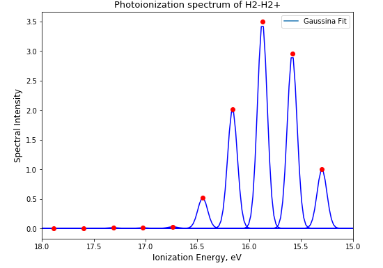
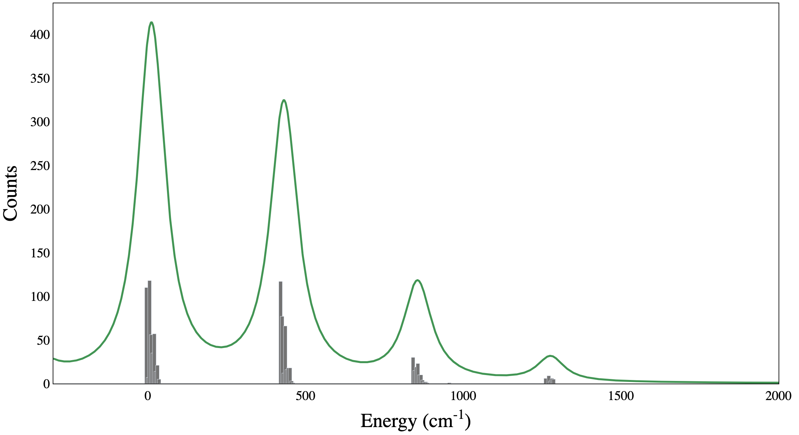
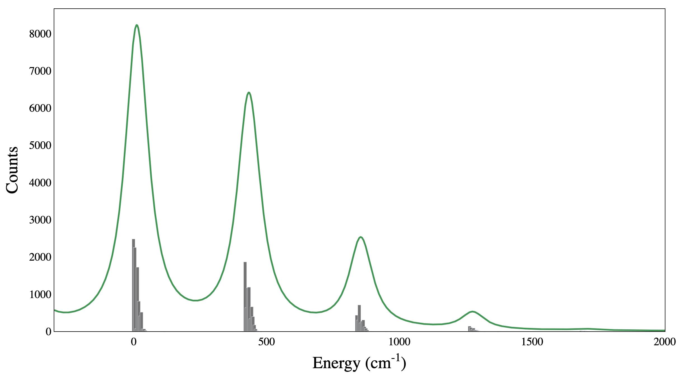

## Project 3: Franck-Condon Factors

In this project our team calculated Franck-Condon Factors (FCF), which are useful in studying vibronic transitions in molecules. We applied different techniques in finding FCF such as harmonic oscillator approximation, Gaussian Boson Sampling (GBS), and Hermite polynomials.

## Tasks and Challenges:

1. [Task #1](https://github.com/olgOk/CohortProject_2020/blob/master/Project_3_Franck_Condon_Factors/Task1.ipynb) In this task, we calculated the FCF and the spectra of molecule Hydrogen using harmonic oscillator approximation. We then approximated each possible transition by Gaussian function. One can infer from the plot that the highest intensity corresponds to the transmition from n=0 to n=2 (0->2) and, thus, corresponds to the most likely vibronic transitions. It means that the wavefunction of the state with n=0 and the state with n=2 are more likely to overlap. 

2. [Task #2](https://github.com/olgOk/CohortProject_2020/blob/master/Project_3_Franck_Condon_Factors/Task2Code/Task2.ipynb) Calculate the Franck-Condon Factors (and spectra) of a more complex molecule (V3) using matrix elements

 

3. [Task #3](https://github.com/olgOk/CohortProject_2020/blob/master/Project_3_Franck_Condon_Factors/Task3.ipynb) Calculate the Franck-Condon Factors (and spectra) of that molecule using vibronic sampling. This calculation involves Gaussian Boson Sampling (GBS), which would allow these factors to be calculated using a quantum circuit.

## Business Application
