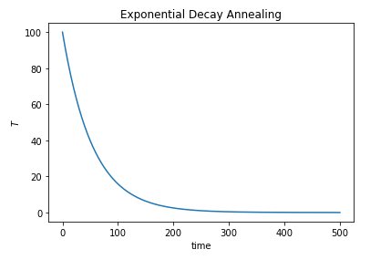
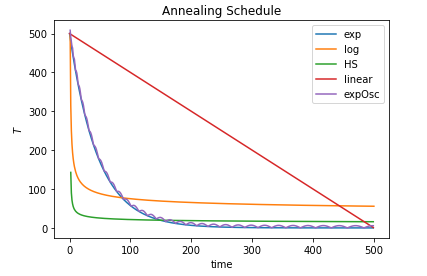

## Project 4: Ising Annealing

This project was focused on the process of mapping an electronic structure Hamiltonian to a classical Ising model and then solving for the ground state of the model using a thermal annealing Monte Carlo simulation. Various annealing schedules were explored and a new one was developed to help solve the mantis model. 

## Tasks:
### Task 1: 
In the [Task 1](./Task_1.ipynb) we perform thermal annealing to solve for the ground state of a ferromagnetic Ising model exploring Monte Carlo methods for developing approximate solutions. 

### Task 2: 
In the [Task 2](./Task_2.ipynb) we perform thermal annealing using various schedules shown below to solve for the groundstate of disordered Ising models. The schedules used are shown below:

### Task 3:
In the notebook [Task 3](./Task_3.ipynb) we explore using Monte Carlo simulation to solve the Ising model as applied to
the Hydrogen molecule. This class has been written so that any dimension of Ising Hamiltonian can be passed to it, 
meaning that we can solve any classically tractable chemical Hamiltonian using this method. We have used Monte Carlo
sampling to find the ground state energy and spin configuration for the Hydrogen molecule at a variety of bond distances This, when applied to larger molecules is a useful input into commercial applications such as drugs or catalyst
discovery.

### Challenge 1: 
In this challenge found at the end of the [Task 2 notebook ](./Task_2.ipynb), we explore new annealing schedules to solve the fully connected mantis ising model. After comparing various schedulers, the best one was actually a custom schedule. This added oscilations into an expotneital decay and forced them to be positive so there was never a case of going below zero temperature. Compared to the other solutions this convered at a higher temerpature and still had accurate results. Although this schedule worked best for the mantis model, it did not work as well for other systems such as the 1D random bond ising on a periodic chain and fully connected random bond ising models. 

### Challenge 4:
In the [Challenge 4 notebook ](./Challenge_4_Ising_Graph_Partition.ipynb) we have Hamiltonian which describes the 
graph partition problem. In the Graph partition problem we age given an input graph and asked to find two equally-sized
independent graphs. That means splitting the graph into two equally sized sets of nodes with the fewest connections between the two subsets. This is an extremely important problem to solve, as it splits hard intractable graph problems 
(such as the traveling salesman or Max-Cut) into two smaller problems which can be solved on classical or quantum hardware. For example, this classical subroutine can be used to find graphs that fit onto current quantum hardware, 
 which would be otherwise unsolvable given the number of qubits currently available, allowing us to accelerate the time needed to solve graph problems leveraging quantum hardware.
* Perform thermal annealing to solve for the groundstate of disordered Ising models.
* Apply what you have learned to solve the Hydrogen molecule ground state.

## Business Application
For more details refer to the [Business Application found here](./Business_Application.md
